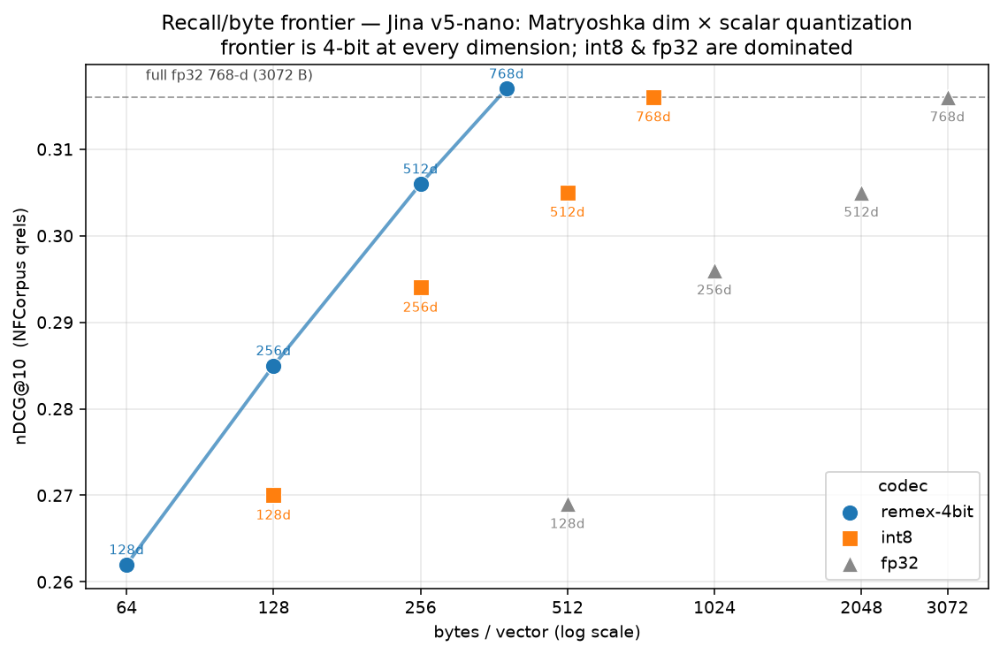

# Byte-optimal embedding retrieval: Matryoshka truncation × scalar quantization

*A research report on compressing a Jina v5-nano retrieval index. The headline:
the two obvious compression levers — cutting dimensions and cutting bits per
dimension — are orthogonal, and the recall/byte frontier comes from composing
them, not from either alone. The detour that got us here is also the lesson:
read the model card before building a compressor.*

---

## Summary

To shrink a stored embedding index you can do two independent things: keep fewer
dimensions, or spend fewer bits on each dimension. For Jina v5-nano (a
Matryoshka-trained, 768-dim retrieval model) we measured both, separately and
combined, on BEIR NFCorpus with real relevance judgments.



Result: **at every byte budget the best operating point is 4-bit TurboQuant-style
scalar quantization applied at the largest Matryoshka dimension that fits.**
Quality is governed by the *dimension* (Matryoshka), storage by the *bit depth*
(quantization); they trade on different axes and compose cleanly. Concretely,
4-bit at the full 768 dims (384 B/vector) reproduces full-float retrieval, and
you go smaller by dropping Matryoshka dimensions underneath it — 256 B at 512-d
(~97% of full nDCG), 128 B at 256-d (~90%). Plain float truncation and 8-bit
quantization are Pareto-dominated everywhere.

Two corrections are baked into this report, because they are the reason the result
is trustworthy now and wasn't before:

1. **We almost shipped a worse, redundant wheel.** A custom 4-bit ONNX export of
   the embedder (170 MB) was dominated by the model authors' official 4-bit ONNX
   (138 MB) that already existed. And we championed full-dimension scalar
   quantization without noticing the model is Matryoshka-trained — truncation is a
   *native* size lever we ignored.
2. **We used a metric that structurally hid the truncation option.** Scoring a
   compressed vector by how well it reproduces the *full-precision* ranking
   penalizes truncation by construction. Switching to absolute retrieval quality
   (qrels) is what let truncation show its real, graceful degradation.

---

## 1. Problem

A dense retrieval index stores one float vector per chunk. At 768 dims × float32
that is 3072 bytes per vector — 307 MB for 100k chunks, before any text. For a
portable, single-file knowledgebase served from a CDN or a constrained container,
that is the dominant cost. The question: how small can the vectors go while
retrieval stays usable?

The embedder is `jinaai/jina-embeddings-v5-text-nano-retrieval` — 239M params,
768-dim, last-token pooling, **Matryoshka dimensions 32/64/128/256/512/768**,
8192-token context. It is the model behind the deployment in question.

Two compression families are available, and they are usually discussed as
alternatives:

- **Dimensionality reduction** — store the first *D* coordinates instead of 768.
- **Scalar quantization** — store each coordinate in fewer than 32 bits.

The contribution here is showing they are not alternatives. They are orthogonal
axes, and the optimum is a point in the grid, not on either edge.

---

## 2. The two axes

### 2.1 Matryoshka truncation (the dimension axis)

Matryoshka Representation Learning (Kusupati et al., 2022) trains a model so that
every prefix of the embedding — the first 32, 64, … 768 coordinates — is itself a
usable embedding, with the most important information packed into the earliest
dimensions. Truncating to *D* dims and re-normalizing yields a valid *D*-dim
vector with no re-encoding. The model card lists the supported prefixes, which is
the tell that this is a first-class operation, not a hack.

Crucially the degradation is *graceful and front-loaded*: dropping the tail costs
less than dropping the head, because training put the signal up front.

### 2.2 Scalar quantization, TurboQuant-style (the bit-depth axis)

remex implements the TurboQuant recipe (Zandieh et al.,
ICLR 2026): apply a fixed Haar-random orthogonal rotation, which by concentration
makes each coordinate approximately i.i.d. N(0, 1/d); then quantize each
coordinate with a Lloyd-Max scalar quantizer whose bin boundaries are MSE-optimal
for that Gaussian; then bit-pack the indices. It is **data-oblivious** (the
quantizer is fully determined by `(dim, bits, seed)` — no training, nothing to
ship but a seed) and stores a code of `dim × bits / 8` bytes.

One structural consequence matters for composition: **the rotation scrambles the
coordinate order.** Matryoshka front-loading lives in the *original* coordinate
basis; after a Haar rotation that ordering is gone. So the two operations do not
commute — you must **truncate first, then quantize within the smaller space.**
Quantize-then-truncate is not available.

### 2.3 Why they compose

Bytes per vector factor cleanly:

```
bytes = D (dimensions)  ×  b (bits/dim)  /  8
```

The dimension axis and the bit axis are independent multipliers. A report that
tests only one of them is reading a 1-D slice of a 2-D surface. The experiment
below reads the surface.

---

## 3. The detour (why this nearly didn't surface)

Briefly, because the failure is instructive, not because it deserves a memorial.

The original effort treated vector compression as a quantization-only problem and
spent its time proving that multi-bit scalar quantization beats 1-bit SimHash on
Jina — true, but not the interesting part. Two things were missed by not reading
the model's own documentation first:

- **The model authors already ship a 4-bit ONNX** (`onnx/model_q4.onnx`, 138 MB,
  via HF Optimum), plus fp16/int8/q4f16 and a full GGUF ladder. A hand-built 4-bit
  export (170 MB) was larger and strictly less faithful — redundant work beaten by
  an artifact that was one API call away.
- **The model is Matryoshka.** Dimension truncation — the native size lever — was
  never put on the same axes as quantization. Worse, an early pass *did* truncate
  (to 512 dims) but scored it against the full-768 ranking and concluded "don't
  truncate Jina," which is backwards from how the model was trained.

The fix for both is one line in a protocol: before building or quantizing a public
model, read its card and sibling artifacts. The salvage is that the *combined*
question — MRL × quantization — turned out to be the genuinely useful result, and
it is novel relative to what either upstream project documents.

---

## 4. Method

**Corpus.** BEIR NFCorpus (medical IR). A fixed corpus-first subsample of 600
documents; the 120 test queries whose relevant set survives the subsample (≥3
judged-relevant docs retained). Real `qrels`.

**Embedder.** Jina v5-nano retrieval, 4-bit ONNX (fp32-parity output: per-vector
cosine ≈ 0.977 to the float export, so the quantized *model* is not a confound for
the *vector* study).

**Grid.** Dimensions D ∈ {128, 256, 512, 768} × codecs {fp32, int8, remex-4bit}.
Truncation re-normalizes the prefix; remex is applied within the truncated space.
int8 is per-vector symmetric. Bytes per vector = D × bits / 8 (fp32 = 4D, int8 =
D, remex-4bit = D/2).

**Two metrics, deliberately.**

- **Absolute retrieval quality** — recall@10 and nDCG@10 against qrels. This is the
  metric that *fairly compares dimensions*, because it asks "did you retrieve
  relevant documents," not "did you reproduce the 768-dim ranking."
- **Fidelity** — recall@10 of the code's top-10 against the *same-dimension* fp32
  top-10. This *isolates quantization loss* at a fixed dimension.

The distinction is the methodological core of the report. A fidelity metric
anchored to the *full-precision, full-dimension* ranking silently punishes any
method that changes the dimension — which is exactly how the earlier "don't
truncate" error was manufactured. Use absolute task metrics to compare
*configurations*; use fidelity-to-same-config to isolate *one* variable.

---

## 5. Results

### 5.1 The recall/byte frontier

Sorted by storage, NFCorpus qrels (n=120; figure above):

| dim | codec | B/vec | recall@10 | nDCG@10 | on frontier |
|--:|---|--:|--:|--:|:--:|
| 128 | remex-4bit | 64 | 0.199 | 0.262 | ✓ |
| 256 | remex-4bit | 128 | 0.210 | 0.285 | ✓ (beats int8@d128, 0.270, same bytes) |
| 512 | remex-4bit | 256 | 0.233 | 0.306 | ✓ (beats fp32/int8@d256, ~0.29) |
| 768 | remex-4bit | 384 | 0.243 | 0.317 | ✓ = full fp32 |
| 512 | int8 | 512 | 0.232 | 0.305 | dominated |
| 768 | int8 | 768 | 0.242 | 0.316 | dominated |
| 256 | fp32 | 1024 | 0.215 | 0.296 | dominated |
| 512 | fp32 | 2048 | 0.232 | 0.305 | dominated |
| 768 | fp32 | 3072 | 0.241 | 0.316 | reference |

**The frontier is entirely remex-4bit**, at varying Matryoshka dimension. Every
fp32 and int8 point is dominated: something on the 4-bit line is at least as good
on quality and smaller in bytes.

### 5.2 What sets quality vs what sets size

Read the table by column and the two axes separate:

- **Dimension sets quality.** nDCG@10 across dims (any codec): 768 ≈ 0.316 → 512 ≈
  0.306 → 256 ≈ 0.29 → 128 ≈ 0.27. Smooth, front-loaded decay — the Matryoshka
  promise, confirmed on absolute retrieval.
- **Bit depth sets size, at almost no quality cost.** Within a fixed dimension,
  fp32 ≈ int8 ≈ remex-4bit on nDCG (deltas ≈ 0.01, within noise). The codecs
  differ in *bytes*, not quality: remex-4bit delivers the same retrieval as fp32 at
  one-eighth the size, and as int8 at half.

So the design rule falls out: **pick the dimension for the quality you need, pick
remex-4bit for the bytes.**

### 5.3 The composition

Starting from the quality ceiling and trading down:

| operating point | B/vec | vs full fp32 |
|---|--:|--:|
| remex-4bit @ 768 | 384 | nDCG 0.317 vs 0.316 — full quality, 8× smaller |
| remex-4bit @ 512 | 256 | ~97% of nDCG, 12× smaller |
| remex-4bit @ 256 | 128 | ~90% of nDCG, 24× smaller |
| remex-4bit @ 128 | 64 | ~83% of nDCG, 48× smaller |

This curve is the deliverable. It is reachable only because the two axes compose;
no single-axis method produces it.

### 5.4 Two supporting results

- **4 bits is the elbow.** A separate fidelity sweep (same vectors, scored against
  same-dim fp32) gives Spearman ρ to the float ranking of 0.92 / 0.978 / 0.998 /
  ~1.0 at 1 / 2 / 4 / 8 bits. 4-bit is already within 0.002 of lossless; 8-bit
  doubles the bytes for the last sliver. 8-bit is for byte-identical scores, which
  retrieval does not need.
- **Bit-depth ordering is embedder-specific.** On a *specialized* encoder
  (SPECTER2) 1-bit outperforms 2-bit (recall-vs-fp32 0.64 vs 0.50) — the inverse of
  Jina (0.77 vs 0.87). Same code, opposite curve; the difference is the embedding
  geometry (tight clusters vs near-isotropic). This is *why* §4 insists on
  per-embedder measurement: a published bit-depth recommendation does not transfer.

---

## 6. Recommendation

For a Jina v5-nano retrieval index that must be small:

1. **Use the official quantized model** (`onnx/model_q4.onnx`, 138 MB) for
   inference. Do not hand-roll one.
2. **Store vectors as remex-4bit at the largest Matryoshka dimension your budget
   allows.** 768-d/384 B is full-quality; this is the default.
3. **Go smaller by dropping Matryoshka dimensions, not bit depth** — 512-d/256 B,
   256-d/128 B — because below 4 bits quality falls faster than dimension does, and
   because the dimension axis is the model's trained, graceful lever.
4. **Truncate before quantizing** (the rotation forecloses the other order).

Plain float or int8 truncation are never the right size play here — both are
dominated by a 4-bit point at equal or smaller bytes.

---

## 7. Methodological takeaways (generalizable)

- **Read the model card before building a compressor.** Native capabilities — MRL
  dimensions, shipped quantized variants, recommended output dim — change or
  obsolete the build. The cheapest experiment is `GET /api/models/{id}?full=true`.
- **Match the metric to the comparison.** Absolute task metrics (qrels nDCG) for
  comparing *configurations* that change the representation (dimension, model);
  fidelity-to-same-config to isolate a *single* variable (bit depth at fixed dim).
  A fidelity metric anchored to the uncompressed configuration will silently
  reject any method that changes that configuration — the bug that produced "don't
  truncate."
- **Evaluate the grid, not the axis.** When two compression levers are
  independent, the optimum is interior. Testing one at a time finds a dominated
  point and calls it a result.

---

## 8. Limitations & next steps

- Single corpus (NFCorpus), n=120 queries; absolute qrels numbers are noisy and the
  codec-within-dimension deltas are small. The strong claim is the *byte*
  dominance of remex-4bit and the dimension/quality coupling, not a quality gap
  between codecs at a fixed dimension.
- Vectors came from our cached 4-bit embedder output; the official 4-bit model is
  near-identical (cos ≈ 0.977 to fp32) but a clean re-run on the official export
  would remove the last asterisk.
- Untested: Matryoshka below 128, learned (data-adaptive) quantization vs
  data-oblivious remex at these dims, and asymmetric (float-query) scoring gains.
- A known, latent footnote: the JavaScript reader and the Python packer can
  disagree on the sign of a near-zero projection under int8-rotation packing —
  irrelevant to the 4-bit vector codec studied here.

---

## References & artifacts

- Kusupati et al., *Matryoshka Representation Learning*, 2022.
- Zandieh et al., *TurboQuant*, ICLR 2026 (rotation + Lloyd-Max scalar quant).
- Charikar, *Similarity Estimation Techniques (SimHash)*, 2002.
- Libraries: `remex` (TurboQuant scalar quant — this repo), `remax` (1-bit
  centered SimHash), `remax_kb` (the portable `.kb`/`.kbi` index that consumes
  these codecs).
- Evaluation: BEIR NFCorpus, 600-doc / 120-query fixed subsample, real qrels;
  embeddings from the official Jina v5-nano 4-bit ONNX (`onnx/model_q4.onnx`).
  Grid = dims {128,256,512,768} × {fp32, int8, remex-4bit}, scored on qrels nDCG@10
  / recall@10 and on fidelity to the same-dim fp32 ranking. The bit-depth elbow
  (1/2/4/8-bit fidelity) and the SPECTER2 embedder-specificity result use the same
  harness; see also `docs/specter2-case-study.md`.
